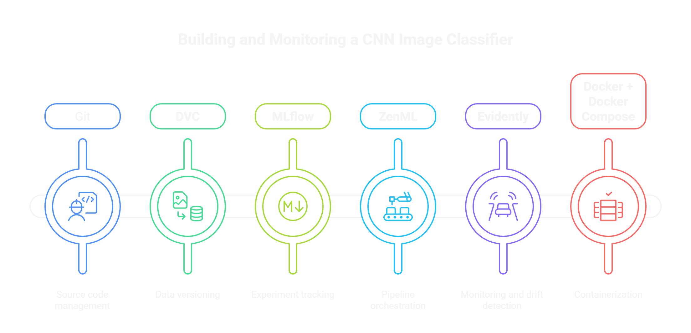
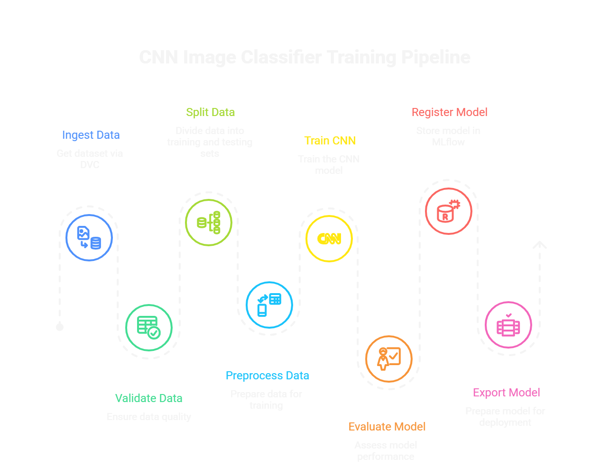
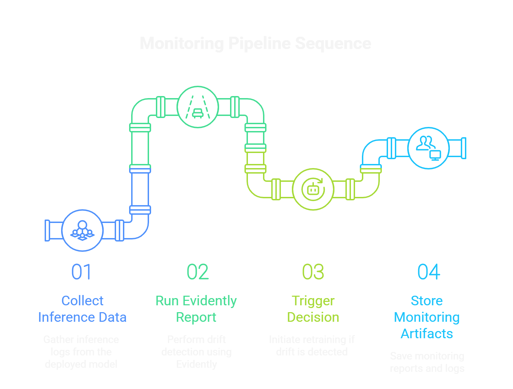
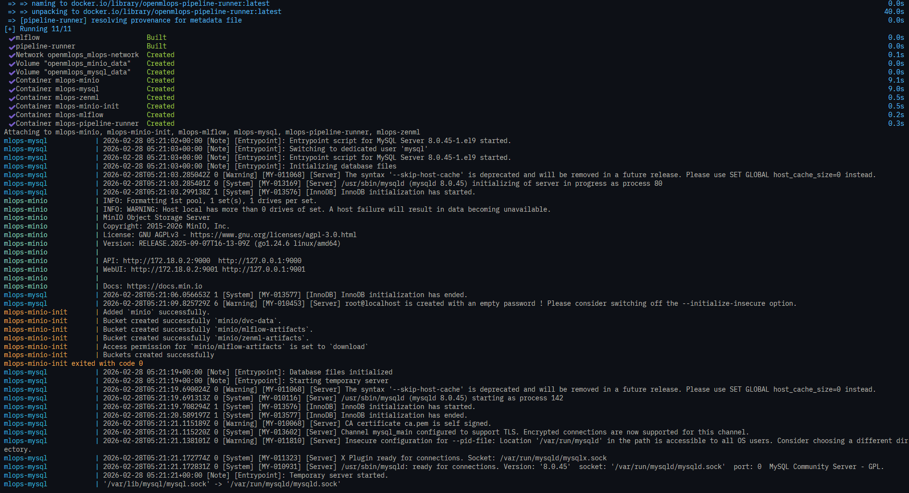
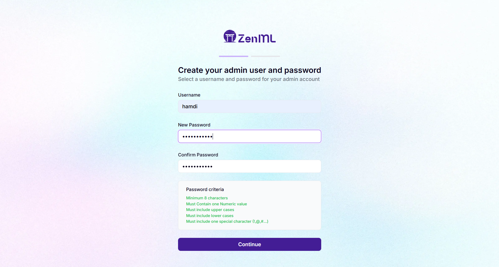
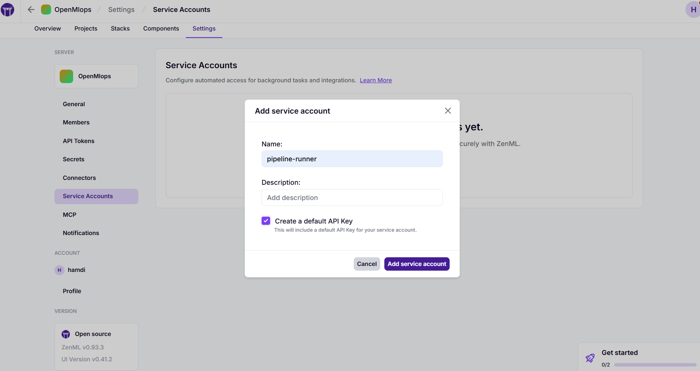
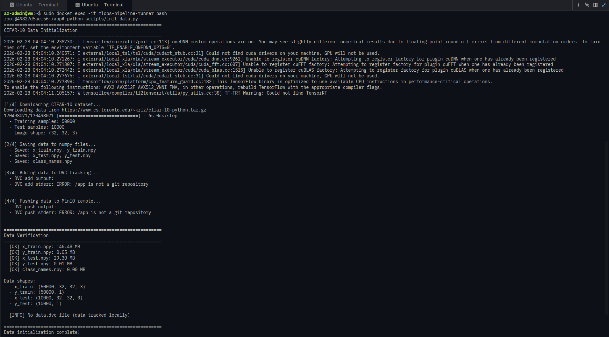

# CNN Image Classifier MLOps Pipeline

A production-ready MLOps pipeline for training and monitoring a CNN image classifier on CIFAR-10 dataset. Built with a fully open-source stack and containerized with Docker.

**Challenge Submission:** Ecole Polytechnique de Sousse



---

## Components

| Tool | Purpose |
|------|---------|
| **Git** | Source code management |
| **DVC** | Data versioning with MinIO remote storage |
| **MLflow** | Experiment tracking, metrics, artifacts, model registry |
| **ZenML** | Pipeline orchestration |
| **Evidently** | Data drift detection and monitoring |
| **Docker + Docker Compose** | Containerization of all services |

---

## Training Pipeline

The training pipeline consists of 8 steps that take raw CIFAR-10 data through to a deployed model.



### Pipeline Steps

| Step | Description |
|------|-------------|
| **1. Ingest Data** | Loads CIFAR-10 dataset from DVC-managed MinIO storage. Pulls data using `dvc pull` and loads numpy arrays (50,000 training + 10,000 test images). |
| **2. Validate Data** | Performs quality checks: shape validation (32x32x3), value range (0-255), label validation (10 classes), NaN/Inf detection, and class distribution analysis. |
| **3. Split Data** | Splits training data into train/validation sets using stratified sampling to maintain class distribution. Default: 80% train, 20% validation. |
| **4. Preprocess** | Normalizes pixel values from [0-255] to [0-1] range, converts to float32, and flattens labels for model compatibility. |
| **5. Train CNN** | Trains a CNN model with configurable hyperparameters. Uses early stopping and learning rate reduction. All metrics logged to MLflow automatically. |
| **6. Evaluate** | Evaluates model on test set. Computes accuracy, precision, recall, F1-score. Generates confusion matrix and per-class metrics. Artifacts saved to MLflow. |
| **7. Register Model** | Registers trained model to MLflow Model Registry with version tagging. Includes model signature and sample input for deployment. |
| **8. Export Model** | Exports model in TensorFlow SavedModel format (for TF Serving) and H5 format. Creates model metadata JSON for serving configuration. |

---

## Monitoring Pipeline

The monitoring pipeline detects data drift and triggers retraining when needed.



### Pipeline Steps

| Step | Description |
|------|-------------|
| **1. Collect Inference Data** | Gathers inference logs from the deployed model and loads reference data (training distribution) for comparison. Extracts statistical features from images. |
| **2. Run Evidently Report** | Performs drift detection using Evidently. Compares current inference data against reference data using statistical tests. Generates HTML report and drift metrics. |
| **3. Trigger Decision** | Analyzes drift report and decides if retraining is needed based on drift threshold. If drift share exceeds threshold, recommends retraining. |
| **4. Store Monitoring Artifacts** | Saves drift report (JSON), HTML visualization, and decision summary to local storage and MLflow for historical tracking. |

---

## How to Run

### Prerequisites

- Docker
- Docker Compose

### Step 1: Start All Services

```bash
docker-compose up -d --build
```

This starts all services: MinIO, MySQL, MLflow, ZenML Server, and Pipeline Runner.



### Step 2: Access ZenML Dashboard

Open your browser and navigate to:

```
http://localhost:8080
```

Create your admin account (first-time setup):



### Step 3: Create Service Account

1. Go to **Settings** > **Service Accounts**
2. Click **Add service account**
3. Name it `pipeline-runner`
4. Check **Create a default API Key**
5. Click **Add service account**
6. **Copy the API key** (you'll need it in the next step)



### Step 4: Connect to Pipeline Runner

Open a terminal and enter the pipeline-runner container:

```bash
sudo docker exec -it mlops-pipeline-runner bash
```

Authenticate with ZenML using your API key:

```bash
zenml login http://zenml-server:8080 --api-key
```

When prompted, paste the API key you copied in Step 3.

### Step 5: Initialize Data

Download CIFAR-10 dataset and set up DVC tracking:

```bash
python scripts/init_data.py
```



### Step 6: Run Training Pipeline

Execute the training pipeline with your desired parameters:

```bash
python run_training.py \
  --epochs 5 \
  --batch-size 64 \
  --learning-rate 0.001 \
  --validation-split 0.2 \
  --early-stopping-patience 5 \
  --model-name cifar10-cnn-classifier
```

**Parameters:**
| Parameter | Description | Default |
|-----------|-------------|---------|
| `--epochs` | Number of training epochs | 20 |
| `--batch-size` | Training batch size | 64 |
| `--learning-rate` | Learning rate for optimizer | 0.001 |
| `--validation-split` | Fraction for validation set | 0.2 |
| `--early-stopping-patience` | Epochs to wait before early stop | 5 |
| `--model-name` | Name for model registry | cifar10-cnn-classifier |

### Step 7: Run Monitoring Pipeline

Execute the monitoring pipeline to check for data drift:

```bash
python run_monitoring.py \
  --sample-size 1000 \
  --add-drift \
  --drift-intensity 0.3 \
  --drift-threshold 0.5
```

**Parameters:**
| Parameter | Description | Default |
|-----------|-------------|---------|
| `--sample-size` | Number of samples to analyze | 1000 |
| `--add-drift` | Add synthetic drift for testing | False |
| `--drift-intensity` | Intensity of synthetic drift (0-1) | 0.3 |
| `--drift-threshold` | Threshold to trigger retraining | 0.5 |

---

## Service URLs

| Service | URL |
|---------|-----|
| ZenML Dashboard | http://localhost:8080 |
| MLflow UI | http://localhost:5000 |
| MinIO Console | http://localhost:9001 |

---

## Project Structure

```
.
├── docker-compose.yml          # Docker services configuration
├── docker/
│   ├── Dockerfile              # Pipeline runner image
│   ├── mlflow.Dockerfile       # MLflow server image
│   ├── entrypoint.sh           # Container initialization
│   └── init-db.sql             # MySQL initialization
├── src/
│   ├── model/
│   │   └── cnn.py              # CNN architecture
│   ├── pipelines/
│   │   ├── training_pipeline.py
│   │   └── monitoring_pipeline.py
│   └── steps/
│       ├── data_steps.py       # Data ingestion, validation, preprocessing
│       ├── training_steps.py   # Training and evaluation
│       ├── model_steps.py      # Model registration and export
│       └── monitoring_steps.py # Drift detection and monitoring
├── scripts/
│   └── init_data.py            # CIFAR-10 download and DVC setup
├── run_training.py             # Training pipeline entry point
├── run_monitoring.py           # Monitoring pipeline entry point
├── data/                       # CIFAR-10 data (DVC tracked)
└── img/                        # Documentation images
```
